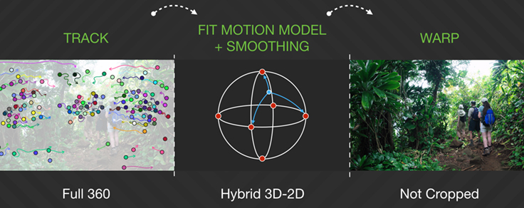
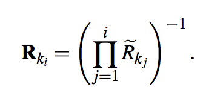
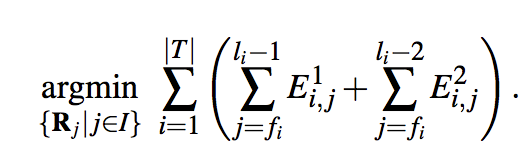
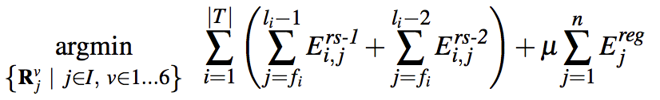
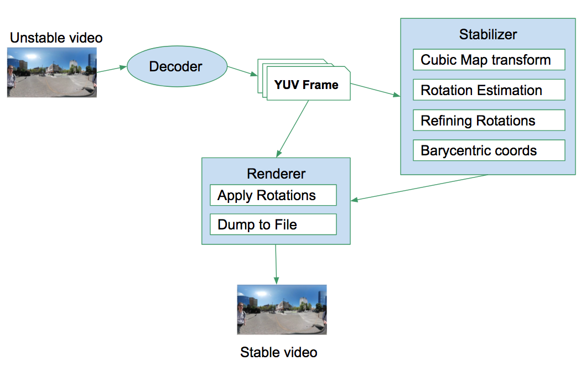

360◦ Video Stabilization
==
p05922002 Pei-Ya Chiu

Motivation
--

- 360◦ 攝影機的硬體在去年與今年開始在消費者市場有銷量成長。
- Facebook 及 Youtube 都已針對 360◦ 影像推出了 VR 觀看模式，未來會有越來越多的人使用此種攝影機產製大量的 360◦ 影像。

Challenges with current 360 video
-- 

1. 經常無法將兩個鏡頭的畫面 stitch 的很好。
2. 兩個鏡頭由於面向角度相反，進光量經常會差很多，鏡頭白平衡的值是不一樣的，大多數軟體的 blending 不夠好。
3.  由於 360◦ 攝影機可以保證將所有事物收入鏡頭，因此**使用者傾向於隨意拍攝而非專注攝影，手震的機會比較大。**
4. 經常搭配 VR 眼鏡觀看，對**影像的穩定度需求比較大。**

我們 focus 在問題 3, 4，實作了 **Johannes Kopf** 提出的 **360◦ Video Stabilization** 演算法。

Algorithm
--

Getting R (aggregated rotation inverse):

Smoothing R by optimizing two error function:

, 

Details are in parper:

[Paper](http://dl.acm.org/citation.cfm?id=2982405)

[Blog](https://code.facebook.com/posts/697469023742261/360-video-stabilization-a-new-algorithm-for-smoother-360-video-viewing/)

Code Architecture
--

- **Decoder:**
	- OpenCV to read frames from mp4 file
- **Stabilizer:**
   - Cubic map: OpenCV remap() to convert frames to cubic map 
   - Rotation estimation: OpenCV feature extraction & optical flow to estimate transform on cubic map
   - Refining Rotations: Ceres Optimizer library to optimize R using Jacobian
   - Barycentric Coordinate Transform: Use quaternion on Barycentric Coordinate to do Rotation matrix interpolation

Difficulties
-
1. The paper is so rough and it assumes a lot of background knowledges like:
	-  Quaternion and Barycentric Coordinates
	
	It contains only 9 pages but it's really a complicated system. We have to keep guessing & googling to understand the concepts in this paper.
2. To handle operations on sphere we have to do lots of coordinate transforming. 

   
   
What we achieved
-
- An offline 360◦ Video Stabilization tool (flie in, file out)

What we haven't done
-
- Realtime stabilization process
- Interest point (User's intent) detection

Reference 
-
[Github](https://github.com/lockercho/stabilization-for-360) 

